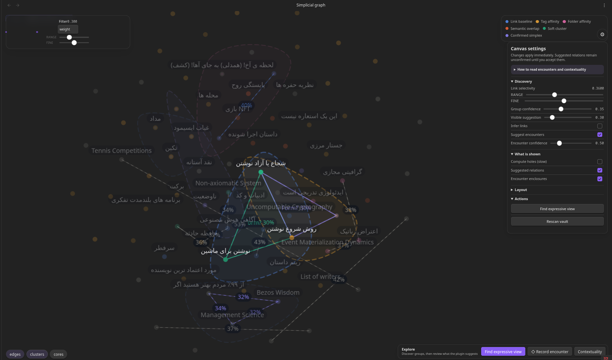

# Simplicial Complex for Obsidian

A knowledge graph plugin that replaces pairwise links with **higher-order structure** — clusters of notes that only make sense together, rendered as a living, organic field.
My blog post about the motivation and process of creating this plugin : [blog post](https://zorvan.medium.com/i-built-a-tool-to-map-my-thoughts-it-failed-then-it-changed-how-i-think-01528fb40bf4)

---


---

## What This Is

Obsidian's built-in graph says: _"Note A links to Note B."_

This plugin says: _"Notes A, B, and C form a unit that only makes sense together."_

That difference — between connection and coherence — is the entire idea. The underlying structure is a [simplicial complex](https://en.wikipedia.org/wiki/Simplicial_complex): a mathematical object that encodes higher-order relationships between notes using triangles, tetrahedra, and beyond, rather than simple edges.

The interface is deliberately **organic and ambient**. Clusters appear as soft fields. Structure emerges over time. The math stays hidden until you want it.




---

## Why Not Just Use Tags or Groups?

|                             | Tags | Groups | Links | **Simplices** |
| --------------------------- | ---- | ------ | ----- | ------------- |
| One-to-many                 | ✅   | ✅     | —     | —             |
| Pairwise connection         | —    | —      | ✅    | ✅            |
| Higher-order coherence      | —    | —      | —     | ✅            |
| Overlapping clusters        | ✅   | —      | —     | ✅            |
| Future topological analysis | —    | —      | —     | ✅            |

Tags classify. Links connect. **Simplices encode coherence** — the idea that a set of notes, taken together, forms a meaningful unit that its members alone do not.

---

## Visual Overview

```
Organic view (default)          Formal view (v3)

  ·startup·                      startup ─── capital
 ╭───────────╮                      \       /
 │  capital  │  ←── 2-simplex         talent
 │           │       (cluster)
 │  talent   │
 ╰───────────╯

Soft blob = coherent cluster    Crisp triangle = same data
```

Both views are projections of the same underlying simplicial model. Toggle between them without changing your data.

---

## Features

**Hypergraph layer (v0.4.0):** A second kind of togetherness. `◇` records an irreducible encounter that makes no claim about its subgroups — no faces generated, no effect on topology. Four explicit transformations between encounters and simplices, and an append-only history of how each relation came to be.

On first scan the plugin also proposes lightweight, in-memory `◇` candidates from existing coherent fields and cross-field junctions. These are visibly marked as suggestions and create no provenance or note changes until explicitly confirmed.

**Core:** Organic blob renderer, living force-based layout, hover focus, dimension filtering, node pinning, real-time vault updates, formal geometric view, lasso selection, simplex-to-note promotion, centrality analysis.

**Analysis & Inference:** Edge inference from tags/links/folders, suggestion system for missing connections, temporal decay, and centrality measures.

**Topological Analysis (v3):** Real-time Betti numbers (β₀, β₁, β₂), phantom hole visualization, and live Betti HUD.

**Contextuality (v3):** Define overlapping contexts and give the same note a different local role in each. The Contextuality Lab reports whether those readings glue, identifies H¹ obstruction cycles, and shows the contextual fraction. A crimson failed seam means existing local meanings cannot be reconciled; it is not an orange topological hole, where a filler is absent.

**Optional external-agent help:** Encounter creation and the Contextuality Lab include provider-neutral, copyable prompts for a file-capable agent. The plugin itself never invokes an AI service or sends vault content anywhere. Agents prepare cited proposals; the user reviews and records every meaning-changing intervention. See [AI-assisted discovery](docs/AI-assisted-discovery.md).

**Emergent Inference (v3):** Semantic clustering with TF-IDF, emergent edge detection, hybrid inference modes, domain-aware coloring.

_See [Technical Details](#technical-details) for complete feature documentation._

---

## Quick Start

**Installation:**

```bash
git clone https://github.com/zorvan/simplicial-complex
cd simplicial-complex
npm install
npm run build
```

Copy `main.js`, `manifest.json`, and `styles.css` to `.obsidian/plugins/simplicial-complex/` in your vault.

**Create your first simplex:**

In any note, type:

```markdown
△ startup capital talent
```

Or use YAML frontmatter:

```yaml
---
simplices:
  - nodes: [startup, capital, talent]
    label: "founding engine"
---
```

Open the Simplicial Complex view to see your cluster as a living, organic field.

**Record your first encounter:**

When notes belong together but you are _not_ prepared to say their pairs are meaningful on their own:

```markdown
◇ Levinas AI-Agent refusal
```

No faces are generated. If the triad later proves compositional, promote it — you will be shown exactly which relations you are about to assert.

---

# Technical Details

## Two Kinds of Togetherness

The plugin models two different claims about a group of notes, and keeps them structurally separate.

| Claim         | Syntax | Means                                                                                      |
| ------------- | ------ | ------------------------------------------------------------------------------------------ |
| **Simplex**   | `△`    | The group is coherent **and so are its sub-relations**. Its faces are generated.           |
| **Hyperedge** | `◇`    | These notes came together as **one irreducible encounter**. No pair within it is asserted. |

If `Levinas`, `AI Agent` and `Refusal` appeared together during one insight, that does not by itself mean Levinas–Refusal is independently meaningful. The triad may be the smallest unit that makes sense. That is a hyperedge, and generating its faces would assert something you never claimed.

A simplex is not "a better hyperedge." It is a different achievement: the relation has become compositional, supported across its faces. Moving between the two is always an explicit act — see [Transformations](#transformations).

**The invariant:** a hyperedge never generates faces, never enters the simplicial complex, and never affects Betti numbers. An encounter over a triad leaves the triangular hole in that triad exactly where it was — only a simplex fills it.

---

## Defining Encounters

### Inline shorthand

```markdown
◇ Levinas AI-Agent refusal
```

`hyperedge:` and `encounter:` work as prose aliases for `◇`. Unlike `△`/`△△`, arity is unbounded — every token on the line becomes a participant, because the group is the unit.

Use the **Insert encounter hyperedge marker** command if `◇` is awkward to type.

### YAML frontmatter

```yaml
---
hyperedges:
  - nodes: [Levinas, AI Agent, refusal]
    label: "unmandated ethical interruption"
    mode: encounter
---
```

`mode` is your own vocabulary for what sort of encounter it was. `simplices:` and `hyperedges:` are independent arrays — a note may carry both, and the plugin never touches your other frontmatter keys.

### Visual language

Encounters render as **open dashed enclosures** with low fill and no interior gradient — present, but visibly provisional — against the solid membranes of the simplicial fields. Encounters over more than eight notes get per-member markers instead of a hull, since at that size the hull would describe the layout rather than the relation.

---

## Transformations

Four explicit moves, all user-initiated. Available in the metadata panel and the canvas context menu.

| Transformation         | Effect                                                                                              |
| ---------------------- | --------------------------------------------------------------------------------------------------- |
| **Create encounter**   | Records a hyperedge. No faces.                                                                      |
| **Promote to simplex** | You assert the faces are meaningful. Shows the exact list first; keeps the encounter as provenance. |
| **Relax to encounter** | Withdraws the closure claim, keeps the group relation. Faces another simplex still asserts survive. |
| **Crystallize**        | A recurring encounter precipitates a new note naming what keeps emerging.                           |

**Recurring encounters are never promoted automatically.** Repetition is evidence, not proof, of simplicial coherence. Recurrence only unlocks crystallization; the assertion stays yours to make.

Because promotion retains the encounter, promote → relax is reversible and the journey stays legible.

---

## Relation History

Every transformation destroys or overwrites something. Without a record, the plugin would quietly assert that the current state was always the state.

So it keeps an append-only log — `_simplicial-history.md` by default — of `encountered`, `recurred`, `created`, `promoted`, `relaxed`, `crystallized` and `dissolved` events, each with a timestamp, the node set, and who did it. Corrections are new events, never edits. Dissolving a relation does not dissolve its history.

Recurrence is a query over this log rather than a stored counter, so it cannot drift from what actually happened. A rescan is deliberately _not_ an encounter — re-reading the same `◇` line on every startup would inflate recurrence into meaninglessness.

Both the log and its path are configurable; disabling it stops new entries and never deletes existing ones.

Select a simplex or encounter to see its dated journey and descendants in the metadata panel. The canvas replay
slider scrubs the append-only log without mutating the live vault; **Live** returns to the present. Crystallized notes
store their `originatingEncounter`, while the source encounter stores the resulting note, so lineage survives reloads
in both directions.

---

## Defining Simplices

Simplices are defined directly in your vault files. Two syntaxes are supported:

### Inline shorthand

```markdown
△ startup capital talent
△ startup regulation market
△△ startup product market users
```

- `△` — a 2-simplex (3 nodes forming a cluster)
- `△△` — a 3-simplex (4 nodes forming a core)
- Node names are space-separated and matched to note titles (case-insensitive)

**Can't type △?** Use `Ctrl/Cmd + Shift + S` in any markdown editor — it inserts `△` at the cursor.

### YAML frontmatter (with metadata)

```yaml
---
simplices:
  - nodes: [startup, capital, talent]
    label: "founding engine"
    weight: 0.9
  - nodes: [startup, regulation, market]
    label: "market context"
    weight: 0.6
---
```

Frontmatter and inline markers are **merged** — a note may use both, and entries are deduplicated per kind. (Before v0.4.0, frontmatter silently suppressed inline markers in the same note.) Use frontmatter when you want to attach a label or weight.

### Face generation

When you define `[A, B, C]`, the plugin automatically generates all sub-faces: `[A, B]`, `[B, C]`, `[A, C]`. This keeps the model mathematically valid. Auto-generated faces render more faintly than user-defined ones.

> **Note:** Face generation is capped at dimension 4 (5-node simplices) to prevent combinatorial explosion. Higher-order simplices are stored but faces are computed lazily on demand.

---

## Interaction Model

The plugin follows one principle: **interaction reveals structure, it does not manipulate it.**

| Action                 | Effect                                                      |
| ---------------------- | ----------------------------------------------------------- |
| Hover node             | Focus mode — simplex fields intensify, unrelated nodes fade |
| Move away              | Focus releases with a 150ms fade                            |
| Click-and-hold node    | Momentary repulsion — push overlapping neighbors apart      |
| Double-click node      | Pin/unpin — fixes position across sessions                  |
| Toggle `1` / `2` / `3` | Show/hide edges, clusters, cores                            |
| `F`                    | Lock focus on hovered node until Escape                     |
| `P`                    | Open metadata panel for hovered simplex                     |
| `Escape`               | Clear all focus and selection                               |

---

## Metadata

Every simplex can optionally carry:

**Label** — a human name for the cluster. Shown on hover in the side panel. Assigned lazily — never required at creation time.

**Weight** — cohesion intensity from 0.1 to 1.0. Affects blob density and the strength of attraction forces in the layout. Felt, not displayed. Defaults to 1.0.

Colors are deterministic by simplex order, with stable per-simplex variation inside each order family, so clusters do not all collapse into the same exact color.

---

## Persistence

By default, simplex definitions are written to the YAML frontmatter of the note they conceptually belong to. This keeps the vault as the single source of truth and works correctly under Obsidian Sync.

You can switch to a central `_simplicial.md` file in settings if you prefer to keep definitions in one place.

---

## Vault Access and Privacy

This plugin enumerates every markdown file in your vault (`vault.getMarkdownFiles()`) and reads their contents. That is inherent to what it does: it renders a graph over the whole vault, and relation markers can appear in any note.

What it does with that access:

- **Reads** note bodies for `△`/`◇` markers and frontmatter, and note metadata (links, tags, folders, aliases) to infer relations.
- **Writes** only to: the frontmatter arrays it manages (`simplices:`, `hyperedges:`) in notes you act on, the central file if you enable that mode, the relation history file, and notes you explicitly create via promote or crystallize. Unrelated frontmatter keys and note bodies are left untouched.
- **Sends nothing anywhere.** The plugin makes no network requests of any kind. There is no telemetry, no sync, no external service. Everything stays in your vault and Obsidian's local plugin data.

Alias resolution builds its index once per vault change rather than per lookup, so enumeration happens when notes change, not on every relation token.

---

## Complete Feature List

### Core (v1–v2)

- **Organic blob renderer** — clusters visualized as soft, overlapping fields. Blobs use a capsule-union metaball approach that correctly handles any node arrangement, including non-convex shapes.
- **Living layout** — force simulation with simplex cohesion and gentle breathing. Layout never fully settles; it drifts quietly when idle, wakes on interaction or vault changes.
- **Sleep mode** — the render loop pauses when kinetic energy falls below threshold. No idle CPU drain.
- **Hover focus** — hovering a node reveals only its structural context. Everything else fades. No click required.
- **Dimension filter** — toggle edges, clusters (2-simplices), and cores (3-simplices and higher) independently.
- **Metadata panel** — optional label and weight per simplex. Weight is felt (blob density), not displayed as a number.
- **Node pinning** — double-click any node to fix its position across sessions. Click-and-hold to temporarily push overlapping neighbors apart.
- **Rename tracking** — renaming a note in Obsidian automatically updates all simplex references without losing layout positions.
- **Real-time updates** — vault changes (create, modify, delete, rename) update the graph live.
- **Formal/geometric view** — toggle between organic blobs and crisp geometric rendering with wireframe edges.
- **Lasso-select creation** — click and drag to draw a lasso around nodes, then open the create-simplex dialog directly on the canvas.
- **Promote simplex to note** — compress a cluster into a first-class vault concept. The new note links to all member nodes.
- **Filtration controls** — reveal structure layer by layer by weight threshold. Choose from weight, confidence, or decayed-weight metrics.
- **Simplex centrality analysis** — identify which notes anchor the most clusters. Displayed in the metadata panel and global analysis view.

### Analysis & Inference (v2+)

- **Edge inference** — infer lightweight edges from tags, outbound links, title/content overlap, and folder co-location.
- **Suggestion system** — detect triangle closures and soft clusters with configurable confidence threshold. Render suggestions directly on the canvas.
- **Temporal decay** — older simplices gradually lose strength, allowing your graph to naturally shift focus toward recent work.
- **Centrality measures** — simplex centrality per node, plus global hub identification.

### Topological Analysis (v3)

- **Betti numbers (β₀, β₁, β₂)** — real-time computation of topological invariants showing connected components, unfilled triangles (holes), and hollow shells (voids).
- **Phantom hole visualization** — missing simplices rendered as dashed orange outlines on the canvas. Click to create the missing connection.
- **Hole-as-prompt interaction** — hover over a phantom hole to see which notes would complete the structure.
- **Live Betti HUD** — display current Betti numbers in the top-left corner of the canvas.

### Emergent Inference Engine (v3)

- **Semantic clustering** — automatically group notes by content similarity using TF-IDF vectorization and k-means clustering.
- **Emergent edge detection** — discover relationships based on shared semantic domains, not just explicit links.
- **Hybrid inference modes** — choose between Emergent (graph-based), Legacy (rule-based), or Hybrid systems.
- **Domain-aware coloring** — notes colored by their semantic cluster or folder structure.
- **Interaction reinforcement** — tracked interactions boost edge weights, making frequently-used connections stronger.

### UI/UX Improvements (v3)

- **Floating canvas controls** — gear icon on the canvas opens real-time parameter adjustment panel.
- **Dual-slider precision controls** — Link Threshold and Filtration use coarse+fine dual sliders for precise tuning.
- **Adaptive value displays** — sliders show appropriate decimal precision.
- **Reorganized settings panel** — Emergent options prioritized, Legacy options organized separately.
- **Explanation cards** — human-readable explanations for inferred simplices in the metadata panel.

---

## Configuration

Open Settings → Simplicial Complex to configure:

### Display & Interaction

| Setting                | Default          | Description                                                                |
| ---------------------- | ---------------- | -------------------------------------------------------------------------- |
| Persistence mode       | `source-note`    | Where simplex definitions are written — note frontmatter or a central file |
| Central file           | `_simplicial.md` | Path for central file mode                                                 |
| Show edges             | On               | Render dim-1 simplex capsules and edge lines                               |
| Show clusters          | On               | Render dim-2 simplex blobs                                                 |
| Show cores             | On               | Render simplices with dimension 3 and higher                               |
| Max rendered dimension | 12               | Cap visual rendering (higher-order still stored)                           |
| Noise amount           | 0.12             | Breathing intensity of the layout                                          |
| Sleep threshold        | 0.01             | Kinetic energy level at which the layout pauses                            |
| Dark mode              | Auto             | Follow system, or force light/dark                                         |
| Formal mode            | Off              | Switch from ambient blobs to geometric rendering with analysis overlays    |
| Label density          | 0.5              | How many non-focused labels render before decluttering hides the rest      |
| Metadata hover delay   | 300ms            | Time before metadata panel updates on node hover                           |

### Vault Linking

| Setting               | Default | Description                                                              |
| --------------------- | ------- | ------------------------------------------------------------------------ |
| Link graph baseline   | Off     | Always show note-to-note vault links as 1-simplices                      |
| Enable inferred edges | On      | Use tags, links, titles, content, and folders to infer lightweight edges |
| Inference threshold   | 0.25    | Minimum combined signal before an inferred edge is created               |

### Edge Inference Weights (when enabled)

| Setting                | Default | Description                                          |
| ---------------------- | ------- | ---------------------------------------------------- |
| Link weight            | 0.25    | Strength added by a resolved outbound link           |
| Mutual link bonus      | 0.1     | Extra weight when both notes link each other         |
| Shared tag weight      | 0.15    | Weight contributed by each shared tag                |
| Title overlap weight   | 0.2     | Maximum title-token overlap contribution             |
| Content overlap weight | 0.15    | Maximum body-text overlap contribution               |
| Same folder weight     | 0.1     | Boost when two notes share the same folder           |
| Top folder weight      | 0.05    | Boost when two notes share the same top-level folder |

### Suggestions & Analysis

| Setting              | Default | Description                                                        |
| -------------------- | ------- | ------------------------------------------------------------------ |
| Show suggestions     | On      | Render closure and soft-cluster suggestions directly on the canvas |
| Suggestion threshold | 0.6     | Confidence level required before a suggestion is surfaced          |
| Command simplex size | 3       | How many nodes the create-from-open-note command tries to include  |

### Layout Optimization

| Setting              | Default | Description                                                        |
| -------------------- | ------- | ------------------------------------------------------------------ |
| Sparse edge length   | 150     | Preferred spacing for sparse link-only graphs                      |
| Sparse gravity boost | 1.5     | Extra centering force when the graph is mostly pairwise and sparse |

### Filtration

| Setting              | Default  | Description                                                                                         |
| -------------------- | -------- | --------------------------------------------------------------------------------------------------- |
| Filtration metric    | `weight` | Which simplex strength field the live filtration slider uses: weight, confidence, or decayed-weight |
| Filtration threshold | 0        | Hide simplices below this threshold in the active metric                                            |

---

## Design Decisions

**Why both simplicial complexes and hypergraphs?** _(revised in v0.4.0)_
Earlier versions modelled only simplicial complexes, on the grounds that they are the mathematically better-behaved subset: built-in hierarchy, rigorous topological analysis, elegant rendering. That is all still true, but it was answering the wrong question. Automatic face generation is correct for simplices and wrong for encounters — it asserts closure nobody claimed. Emergence that cannot be reduced to proper subgroups belongs first to the hypergraph; simplicial structure is what a relation becomes once its coherence is supported across its faces. So the plugin now carries both layers and makes the move between them an explicit, reversible, recorded act.

**Why keep the encounter after promoting it?**
Discarding it would rewrite the history the relation log exists to protect, and it is what makes relaxation reversible. Two relations over the same node set is exactly the state the namespaced key scheme (`s:` / `h:`) was built to support.

**Why organic blobs and not crisp triangles?**
The primary use case is cognitive — building and navigating a personal knowledge base. Soft blobs are easier to perceive as "fields of meaning" than precise geometry. The formal geometric view (crisp triangles, wireframe tetrahedra) is planned for v3, when topological analysis becomes the focus.

**Why not store simplices in a database?**
The vault is the source of truth. Simplex definitions stored in frontmatter are human-readable, version-controllable, and survive plugin reinstalls and Obsidian Sync without conflict. The plugin reads from the vault; it does not own the data.

**One data model, two views.**
The organic renderer and the future formal renderer are both projections of the same `SimplicialModel`. Switching views requires no data migration.

---

## Architecture

The plugin is structured around a strict layering principle:

```
VaultIndex  →  SimplicialModel  →  LayoutEngine  →  Renderer
               (source of truth)   (forces)          (projection)
                      ↑
               InteractionController
```

`SimplicialModel` has zero Obsidian API dependencies — it is pure TypeScript and fully unit-testable in isolation. The renderer is a projection and contains no business logic. Interaction perturbs the layout; it never rebuilds it.

A full engineering specification is available at [`SPEC.md`](./SPEC.md).

---

## Mathematical Background

A **simplicial complex** K is a collection of simplices closed under the face operation: if σ ∈ K and τ ⊆ σ, then τ ∈ K.

In this plugin:

- A **0-simplex** is a note (node)
- A **1-simplex** is a coherent pair of notes (edge)
- A **2-simplex** is a coherent triple — the smallest unit of closure
- A **3-simplex** is a coherent quadruple — a "core"

The weight on each simplex defines a **weighted filtered complex**, which in v3 will support persistent homology analysis: revealing which conceptual clusters are robust (persist across weight thresholds) and which are incidental.

---

## Contributing

This project is in active early development. Issues and pull requests are welcome.

Before contributing, please read [`SPEC.md`](./SPEC.md) — particularly §8 (Critical Implementation Checklist) — to understand the architectural constraints that must be preserved.

Areas where contributions are most useful:

- Parser edge cases (special characters in note titles, nested frontmatter, aliases)
- Rendering performance (offscreen canvas caching, frame budget profiling)
- Mathematical analysis layer (Betti numbers, filtration, centrality measures)

---

## License

MIT — see [`LICENSE`](./LICENSE)

---

_"Standard knowledge graphs are fundamentally pairwise. This is not."_
